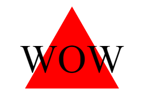

# Simple Logo Generator


## Description

The purpose of this project is to learn how to use a combination of Inquirer and Jest in NodeJS as means to generate a simple SVG logo design via answering prompts. The motivation for this project was to solidify an understanding of Inquirer's syntax for usng prompts to create answer-based files and use testing features for application functionality. The project was built to demonstrate an application that has built-in testing features that check for proper functioning of code that works to generate a simple design logo. The problem this solves is creating an efficient method in generating files based on prompt answers while learning how to test code for functionality. 

## Installation

To install the project, users should open the integrated terminal and type the following to install the packages required for Inquirer v.8.2.4 and Jest:
````
npm i
````

## Usage

In order to use the application, users will right click on the index.js file and open the integrated terminal. Upon opening the terminal, the command "npm run start" will deploy the prompts for users to answer regarding the logo they would like generated. Completion of the prompts will console a message that the logo was created and the file can be found in the "build" folder. Users may choose to open the svg file in a number of ways, including using a live server for the browser or an SVG previewer extension.

## Tests

To test the functionality of the code, users will open the integrated terminal and run the command "npm run test". Once the command is run, the terminal will display the tests' results, indicating what each test should do, what we received within the tests, and the expected output from the tests. If the received input and expected output are a match, Jest will prompt which tests have passed and/or failed. 

## Credits

NodeJS for the open-source server environment. NPM for the software registry, Inquire for the npm package used for prompt questions in generating the logo designs, and Jest for the npm package used for testing code functionality in rendering shapes. Megan Meyers for assistance in writing tests for code functionality and for the code in creating a triangle shape with SVG syntax. MDN Mozilla for further syntax instruction on how to create shapes with SVG syntax. 

## Link(s)

## Images

